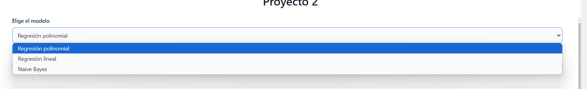
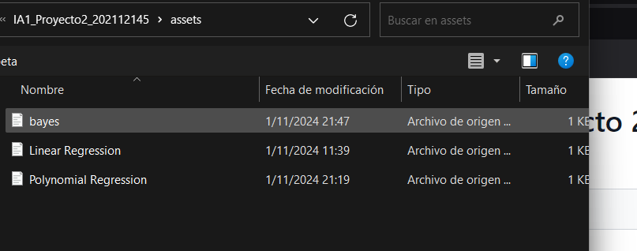
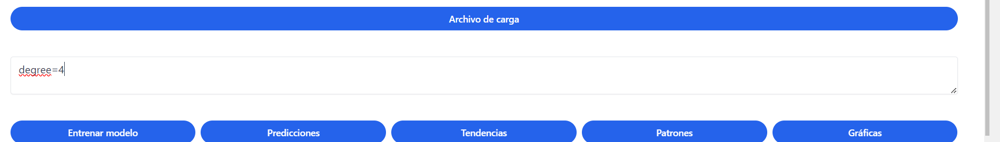
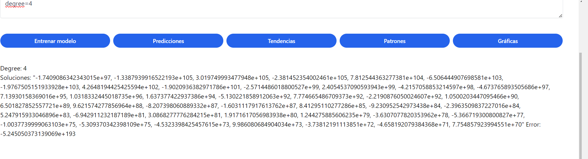
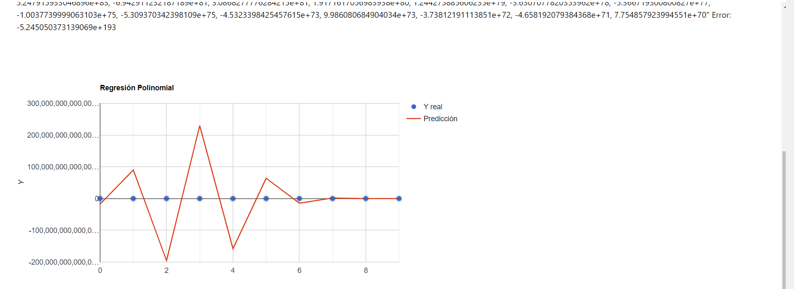
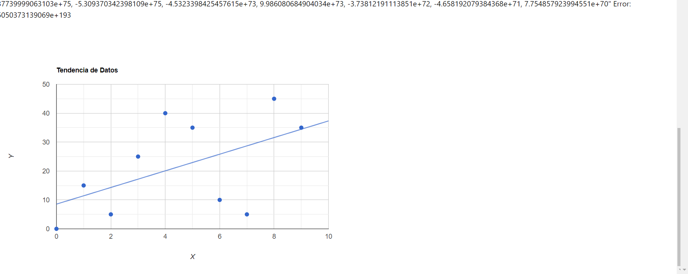
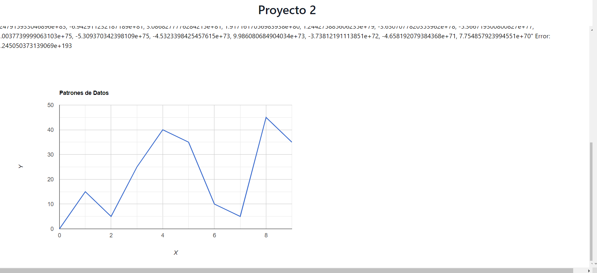

# Manual de Usuario

Este manual te guiará en el uso de la interfaz web de un sistema de machine learning, que permite cargar un archivo CSV, seleccionar un modelo de aprendizaje automático, configurar parámetros y realizar predicciones. Aquí se explican los pasos para operar cada función disponible en la interfaz.

## Descripción General de la Interfaz

La interfaz cuenta con varios elementos:
1. **Selección de Modelo**: Permite escoger el tipo de modelo de aprendizaje automático.
2. **Parámetros del Modelo**: Área para ingresar parámetros adicionales para el modelo.
3. **Botones de Entrenamiento y Análisis**: Incluye botones para entrenar el modelo, realizar predicciones y visualizar tendencias, patrones y gráficos.
4. **Área de Resultados y Gráficos**: Muestra los resultados generados después de entrenar el modelo y permite visualizar gráficos generados.

---

## Guía Paso a Paso

### 1. Selección de Modelo
1. En la sección "Elige el modelo", selecciona el tipo de modelo de machine learning que deseas utilizar:
   - **Regresión Polinomial**
   - **Regresión Lineal**
   - **Árbol de Decisión**

   Esta selección es importante porque cada modelo aplica diferentes métodos para realizar predicciones y análisis de datos.

### 2. Cargar un Archivo CSV
1. Haz clic en el botón **"Archivo de carga"** para cargar un archivo CSV que contiene los datos.
2. Selecciona el archivo desde tu dispositivo y espera a que el sistema lo procese. Este archivo debe estar en formato CSV, con los datos estructurados en columnas.

   > **Nota:** El archivo cargado debe ser un CSV adecuado para el análisis de datos de machine learning, con encabezados en la primera fila.

### 3. Ingresar Parámetros del Modelo
1. En el área **"Parámetros del modelo"**, ingresa los parámetros específicos para el modelo seleccionado (si es necesario). Algunos modelos pueden requerir configuraciones personalizadas para obtener los mejores resultados, como el grado del polinomio para la regresión polinomial o la profundidad máxima para el árbol de decisión.

   > **Ejemplo**: Si seleccionas Regresión Polinomial, podrías especificar el grado de polinomio en esta área.

### 4. Entrenar el Modelo
1. Después de cargar el archivo CSV y establecer los parámetros, haz clic en el botón **"Entrenar modelo"**. Esto ejecutará el proceso de entrenamiento con el modelo seleccionado y los datos proporcionados.
2. Una vez entrenado, los resultados del entrenamiento aparecerán en el área de **Resultados**.

### 5. Realizar Predicciones
1. Haz clic en el botón **"Predicciones"** para que el modelo realice predicciones basadas en los datos entrenados.
2. Los resultados de las predicciones se mostrarán en el área de **Resultados** y podrás ver detalles de los valores predichos.

### 6. Analizar Tendencias y Patrones
- **Tendencias**: Haz clic en el botón **"Tendencias"** para ver gráficos de tendencias dentro de los datos.
- **Patrones**: Usa el botón **"Patrones"** para identificar patrones específicos en los datos.

   Ambos análisis son útiles para comprender cómo se comportan los datos y encontrar regularidades o desviaciones.

### 7. Visualizar Gráficas
1. Al hacer clic en **"Gráficas"**, se generarán representaciones visuales de los datos y los resultados del modelo.
2. Las gráficas aparecerán en el área destinada a gráficos (debajo de los resultados), permitiéndote explorar visualmente las relaciones dentro de los datos y el rendimiento del modelo.

---

## Ejemplo de Flujo Completo

1. **Selecciona** el modelo de **Regresión Lineal** en la lista desplegable de modelos.
2. **Carga** un archivo CSV que contenga las características y etiquetas que deseas analizar.
3. Ingresa un parámetro de modelo, si es necesario, en el campo "Parámetros del modelo".
4. Haz clic en **Entrenar modelo**.
5. Una vez entrenado, haz clic en **Predicciones** para obtener los valores predichos.
6. Usa los botones de **Tendencias** y **Patrones** para observar comportamientos y correlaciones en tus datos.
7. Finalmente, haz clic en **Gráficas** para ver una representación visual de los resultados.

---
